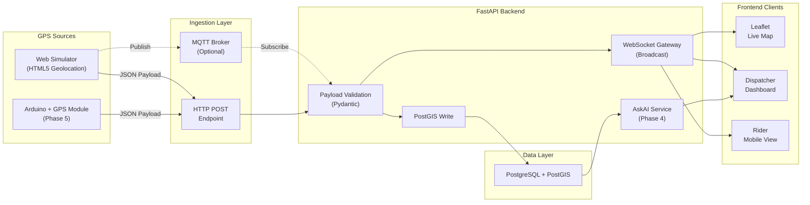

# PolyTrack — System Architecture

## Overview

PolyTrack is a real-time microtransit telemetry system. Telemetry flows from GPS sources (simulator or hardware) through an ingestion layer into a PostGIS database, then broadcasts to connected frontends via WebSocket for sub-second map updates.

---

## High-Level Architecture



---

## Data Flow

```
1. GPS Source → packages (lat, lng, timestamp, device_id) as JSON
2. JSON → HTTP POST /api/v1/telemetry  (or MQTT topic: polytrack/telemetry/{device_id})
3. FastAPI validates payload via Pydantic model
4. Validated point → INSERT into PostGIS (geometry POINT, SRID 4326)
5. Validated point → broadcast to all WebSocket subscribers
6. Frontend receives WS message → updates map marker position
```

---

## Service Topology (Docker Compose)

| Service | Image / Build | Port | Purpose |
|---------|---------------|------|---------|
| `api` | `./Dockerfile` (FastAPI) | `8000` | REST API + WebSocket gateway |
| `db` | `postgis/postgis:16-3.4` | `5432` | PostgreSQL with PostGIS |
| `mqtt` | `eclipse-mosquitto:2` | `1883` | MQTT broker (optional) |
| `ollama` | `ollama/ollama:latest` | `11434` | Local LLM host for Ask AI feature |

---

## Database Schema (Core Tables)

### `devices`
| Column | Type | Description |
|--------|------|-------------|
| `id` | `UUID` PK | Unique device identifier |
| `name` | `VARCHAR(100)` | Human-readable device name |
| `device_type` | `VARCHAR(50)` | `simulator` \| `arduino` |
| `created_at` | `TIMESTAMPTZ` | Registration timestamp |
| `is_active` | `BOOLEAN` | Currently transmitting |

### `telemetry_points`
| Column | Type | Description |
|--------|------|-------------|
| `id` | `BIGSERIAL` PK | Auto-incrementing ID |
| `device_id` | `UUID` FK → devices | Source device |
| `location` | `GEOMETRY(POINT, 4326)` | PostGIS point (lng, lat) |
| `altitude` | `FLOAT` | Altitude in meters (nullable) |
| `speed` | `FLOAT` | Speed in m/s (nullable) |
| `heading` | `FLOAT` | Bearing in degrees (nullable) |
| `recorded_at` | `TIMESTAMPTZ` | Timestamp from GPS source |
| `received_at` | `TIMESTAMPTZ` | Server receipt timestamp |
| `batch_id` | `UUID` | Groups store-and-forward batches |

**Index:** `GIST(location)`, `BTREE(device_id, recorded_at DESC)`

### `geofences` (Phase 3+)
| Column | Type | Description |
|--------|------|-------------|
| `id` | `UUID` PK | Unique geofence identifier |
| `name` | `VARCHAR(100)` | Geofence label |
| `boundary` | `GEOMETRY(POLYGON, 4326)` | Geofence boundary |
| `alert_on_enter` | `BOOLEAN` | Trigger alert on entry |
| `alert_on_exit` | `BOOLEAN` | Trigger alert on exit |

---

## Key Architectural Decisions

1. **Store-and-Forward resilience** — The GPS source (simulator or hardware) caches telemetry locally during network drops and batch-uploads upon reconnection. Each batch gets a unique `batch_id` so the server can detect and order delayed data.

2. **WebSocket broadcast on ingestion** — The API broadcasts each validated telemetry point immediately via WebSocket, bypassing any polling delay to achieve sub-second latency.

3. **PostGIS for spatial queries** — Native spatial indexing (GIST) enables efficient geofence checks, nearest-vehicle queries, and historical route reconstruction (ST_MakeLine).

4. **Dead reckoning on frontend** — The client interpolates marker positions between WebSocket updates using last-known speed and heading, ensuring smooth animation even with network jitter.
