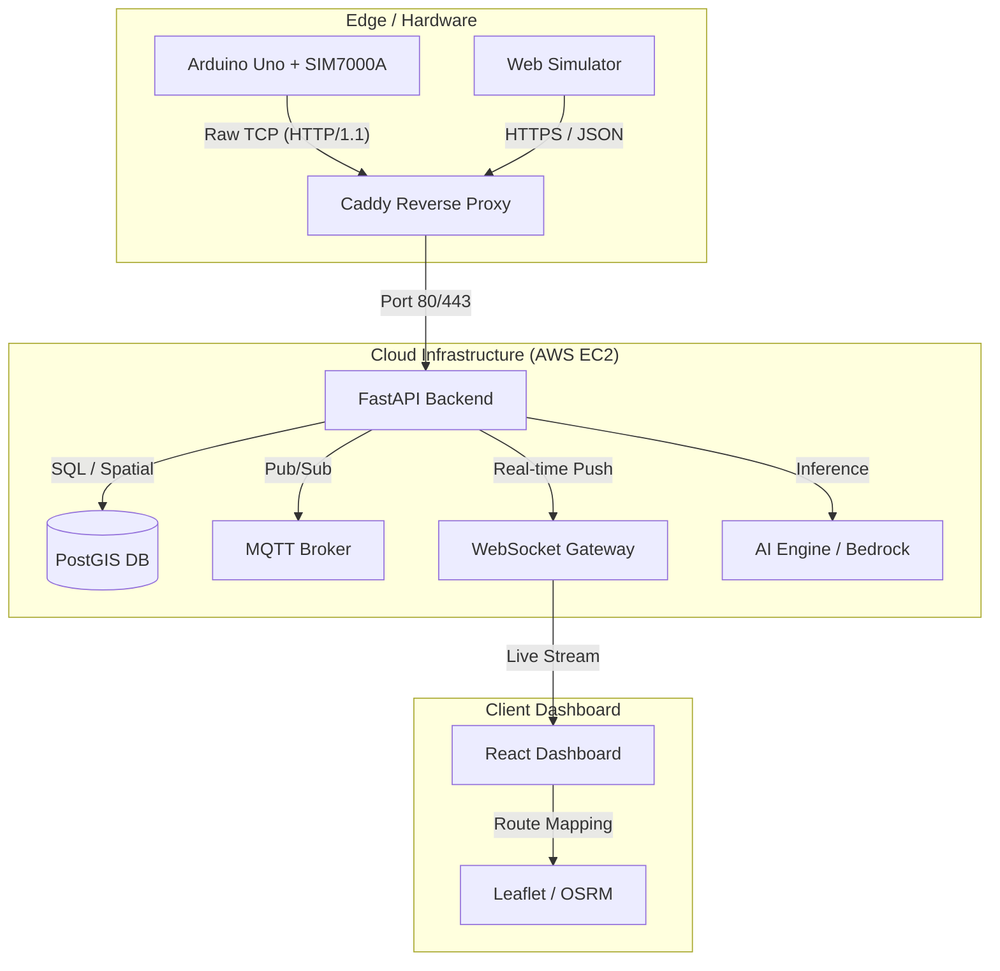

# PolyTrack 🛰️

PolyTrack is a high-performance, real-time microtransit telemetry ecosystem. It provides a robust pipeline for tracking vehicle and device locations with sub-second latency, combining physical hardware tracking (Arduino/SIM7000A) with a high-fidelity web-based dashboard and AI-driven insights.


---

## 📽️ Demo
> [!NOTE]

**Live Site:**https://main.d3717ef36oy0d4.amplifyapp.com/dashboard/

**Video DEMOs:**

https://github.com/user-attachments/assets/5d5e2c63-1381-43f2-accf-d092208019d5

https://github.com/user-attachments/assets/cdc1e044-3fb2-4add-9af9-8c5da518da74

https://github.com/user-attachments/assets/4300ca9d-41c2-45ae-9e73-8b71119d5633

---

## ✨ Core Features

- **Sub-Second Latency**: Real-time position updates using WebSockets (FastAPI + React).
- **Hybrid Tracking**: Support for both physical IoT hardware (SIM7000A) and browser-based simulators.
- **Spatial Intelligence**: Built on **PostGIS** for native geographical math (distance, routing, geofencing).
- **Resilient Ingestion**: Store-and-forward caching logic ensures no data is lost during cellular dropouts.
- **AI-Powered Insights**: Integrated chat assistant (AWS Bedrock / Ollama) for fleet data analysis.
- **Smooth Interpolation**: Custom "Dead Reckoning" logic in the frontend for fluid marker movement.

---

## 🏗️ Technical Architecture



---

## 🔌 Hardware Setup

The project uses a custom-built telemetry node optimized for low-power, long-range cellular tracking.

### Components
- **Microcontroller**: Arduino Uno (or compatible)
- **Cellular Shield**: SIM7000A (LTE-M / NB-IoT)
- **Antenna**: QGP GPS Antenna + LTE Blade Antenna
- **Connectivity**: SIM card with APN configured (default: `wireless.dish.com`)

### Configuration
Hardware code is located in [`/hardware/PolyTrackNode`](file:///Users/sirishgurung/Desktop/PolyTrack/hardware/PolyTrackNode).
- **Communication**: Uses AT commands over `SoftwareSerial` (Pins 10 TX, 11 RX).
- **Protocol**: To bypass SSL overhead on the Arduino, the node uses raw TCP sockets to construct HTTP/1.1 POST requests directly to the server's IP.

---

## ☁️ Cloud Deployment

PolyTrack is designed for production-grade reliability on AWS.

### Infrastructure
- **Host**: AWS EC2 `g4dn.xlarge` (Selected for NVIDIA T4 GPU acceleration for local AI).
- **DNS**: Managed via DuckDNS for dynamic IP resolution.
- **Proxy**: **Caddy** handles SSL termination for the web dashboard while allowing raw HTTP traffic on Port 80 for legacy hardware nodes.

### Deployment Strategy
We use **Docker Compose** to orchestrate the microservices:
1. **FastAPI**: The core logic engine.
2. **PostGIS**: Geographic database.
3. **Mosquitto**: MQTT broker for message queuing.
4. **Ollama**: Local LLM runner (GPU-accelerated).
5. **Caddy**: The gateway.

```bash
# Production Deployment
cd .deploy
docker compose -f docker-compose.prod.yml up -d
```

---

## 🚀 Getting Started (Development)

### 1. Prerequisites
- Docker & Docker Compose
- Node.js (v18+)

### 2. Backend Setup
1. Copy `.env.example` to `.env`.
2. Start services:
   ```bash
   docker compose up -d --build
   ```
3. Run migrations:
   ```bash
   docker compose exec api alembic upgrade head
   ```

### 3. Frontend Setup
1. Navigate to [`/frontend`](file:///Users/sirishgurung/Desktop/PolyTrack/frontend).
2. Install & Run:
   ```bash
   npm install
   npm run dev
   ```

---

## 🛠️ Tech Stack

| Layer | Technology |
|---|---|
| **Backend** | FastAPI, Python 3.11 |
| **Database** | PostgreSQL + PostGIS |
| **Real-time** | WebSockets, MQTT |
| **Frontend** | React, React-Router, Tailwind CSS |
| **Mapping** | Leaflet, OSRM, Nominatim |
| **Hardware** | C++, Arduino, SIMCom AT Commands |
| **AI** | Amazon Bedrock / Ollama (Phi-3) |

---

## 📜 License
This project is licensed under the MIT License - see the [LICENSE](LICENSE) file for details.
