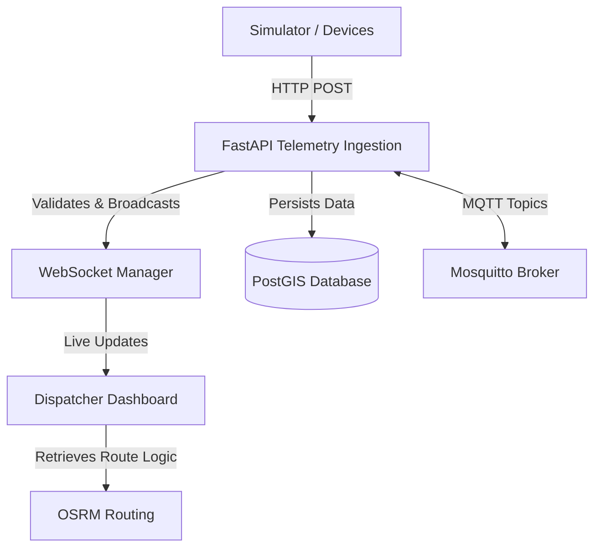
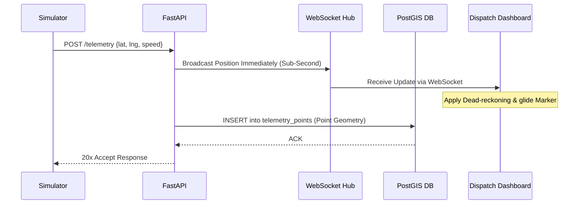

# PolyTrack Technical Onboarding Guide

Welcome to **PolyTrack**, a real-time microtransit telemetry system. This document serves as a comprehensive technical guide to help new developers understand the system's architecture, features, data flows, components, and technology stack.

---

## 1. README / Instruction Files Summary

Based on `README.md` and `FORME.md`:
*   **Project Overview**: PolyTrack is a live tracking ecosystem acting as both the GPS device (via a web simulator) and the control room (dispatch dashboard). It tracks locations with sub-second accuracy and handles temporary network disconnections gracefully using a store-and-forward mechanism.
*   **Setup & Run**: The backend is orchestrated via Docker Compose (`docker-compose up -d --build`). Database migrations are run via Alembic (`alembic upgrade head`). The frontend is a local React Router setup started via `npm run dev`.
*   **Core Philosophy**: "Broadcast First, Save Second". To achieve ultra-low latency, the system pushes data over WebSockets before persisting it to the database.
*   **Navigability Guidelines**: The codebase uses clear boundaries: `backend/` for the FastAPI dispatch API, `frontend/` for the React/Leaflet UI, and `.agents/` for architectural blueprints and guides.

---

## 2. Detailed Technology Stack

### Backend Stack
*   **Language**: Python (detectable via `backend/requirements.txt`)
*   **Framework**: [FastAPI](file:///Users/sirishgurung/Desktop/PolyTrack/backend/requirements.txt#L1) (v0.115+)
*   **Database**: PostgreSQL with PostGIS extension (`postgis/postgis:16-3.4` in [`docker-compose.yml`](file:///Users/sirishgurung/Desktop/PolyTrack/docker-compose.yml#L3)).
*   **Message Broker**: Eclipse Mosquitto (MQTT) running on port 1883.
*   **ORM library**: SQLAlchemy 2.0 with GeoAlchemy2 for spatial data.
*   **Data Validation**: Pydantic v2.

### Frontend Stack
*   **Language**: TypeScript (detectable by `.tsx`/`.ts` configuration in `frontend/package.json`).
*   **Framework**: [React Router v7](file:///Users/sirishgurung/Desktop/PolyTrack/frontend/package.json#L12) framework covering React 19.
*   **Styling**: Tailwind CSS v4.
*   **Map Engine**: [React-Leaflet and Leaflet](file:///Users/sirishgurung/Desktop/PolyTrack/frontend/package.json#L22). Includes Nominatim Geocoding and OSRM routing dependencies.

### Architecture Style
*   **Client-Server MVC/Monolithic API**: A core monolithic API backend serving diverse clients (simulators, dispatch dashboards).
*   **Event-Driven / WebSockets**: Real-time push mechanisms are at the center of the UX.

### Infrastructure & Deployment
*   **Containerization**: Docker & Docker Compose (`docker-compose.yml`).
*   **Package Managers**: `npm` (frontend) and `pip`/`requirements.txt` (backend).

---

## 3. System Overview and Purpose

**Purpose**: PolyTrack provides a seamless way to track simulated or real delivery/transit vehicles in real time. It solves the challenges of displaying live geospatial paths without lag and ensures no positional data is lost if the driver hits heavy network dead-zones.

**Core Functionalities**:
*   **Simulator (Driver)**: Broadcasts current location sequentially. If offline, strings coordinates together and batches them upon reconnection.
*   **Dashboard (Dispatcher)**: Watches cars glide across a Leaflet map. Routes map points flawlessly using "dead reckoning" interpolation. Real-time pathfinding is available via OSRM.
*   **API & Storage (Headquarters)**: Validates incoming HTTP telemetry, broadcasts real-time via WebSockets, and permanently records historical locations into a PostGIS catalog.

---

## 4. Project Structure and Reading Recommendations

### General Organization
*   **`/backend`**: The Python FastAPI application.
    *   `/backend/app/main.py`: The core application setup, middleware, and entry points.
    *   `/backend/app/routers/`: Request handlers (HTTP & WebSocket).
    *   `/backend/app/db/`: Database configuration and Alembic migrations.
    *   `/backend/app/models/`: SQLAlchemy ORM classes and Pydantic schemas.
*   **`/frontend`**: The React application.
    *   `/frontend/app/root.tsx`: Standard React Router wrapper and layout.
    *   `/frontend/app/routes/`: Route pages (`home.tsx`, `dashboard.tsx`).
    *   `/frontend/app/components/`: Specific map and UI features (`LiveMap.tsx`, `DirectionsPanel.tsx`).

### Critical Configuration Files
*   [`docker-compose.yml`](file:///Users/sirishgurung/Desktop/PolyTrack/docker-compose.yml): Specifies the container arrangement (DB, API, MQTT).
*   [`backend/app/config.py`](file:///Users/sirishgurung/Desktop/PolyTrack/backend/app/config.py): The `pydantic-settings` loader that safely imports `.env` secrets.
*   [`frontend/vite.config.ts`](file:///Users/sirishgurung/Desktop/PolyTrack/frontend/vite.config.ts): Build and plugin configuration for React Router and Tailwind.

### Recommended Reading Order
For a new developer, start here:
1.  Read `FORME.md` for context and legacy knowledge.
2.  Read [`backend/app/main.py`](file:///Users/sirishgurung/Desktop/PolyTrack/backend/app/main.py) to spot the router inclusions.
3.  Read [`backend/app/routers/telemetry.py`](file:///Users/sirishgurung/Desktop/PolyTrack/backend/app/routers/telemetry.py) to understand ingestion and broadcasting.
4.  Read [`frontend/app/routes/dashboard.tsx`](file:///Users/sirishgurung/Desktop/PolyTrack/frontend/app/routes/dashboard.tsx) to see how the WebSocket coordinates translate into map movements.

---

## 5. Key Components

### 1. Telemetry Router (`backend/app/routers/telemetry.py`)
**Responsibility**: The central hub. Handles HTTP ingestion endpoints (`POST /api/v1/telemetry`) and manages the main walkie-talkie connection via WebSockets (`/ws/telemetry`).
```python
@router.post("/api/v1/telemetry")
async def ingest_telemetry_single(payload: TelemetryPayload, db: AsyncSession = Depends(get_db)):
    result, status = await process_telemetry(db, payload)
    return JSONResponse(content=result, status_code=status)
```

### 2. Ingestion Service (`backend/app/services/ingestion.py`)
**Responsibility**: Sits immediately behind the router. It forces the "Broadcast First, Save Second" rule by passing data to the WebSockets payload *before* handling the SQLAlchemy inserts.

### 3. Database Models (`backend/app/models/database.py`)
**Responsibility**: Defines PostGIS relationships. The `TelemetryPoint` holds the `location = Column(Geometry("POINT"))` which relies on GeoAlchemy2 to execute spatial queries natively.

### 4. Live Map Module (`frontend/app/components/LiveMap.tsx`)
**Responsibility**: Reads incoming WebSocket event data and feeds it into Leaflet markers. This file implements dead-reckoning logic to interpolate missing location pings and ensure smooth map rendering.

---

## 6. Execution and Data Flows

### The "Driver Radios In" Flow
1.  **Generation**: A frontend simulator (`home.tsx`) captures a GPS point via browser `navigator.geolocation`.
2.  **Transport**: The point is sent to FastAPI as a single `POST /api/v1/telemetry` or batch HTTP request.
3.  **Validation**: A Pydantic validator (`TelemetryPayload`) checks standard bounds (latitude between -90 and 90).
4.  **Broadcast**: The API leverages the `ws_manager` to send the payload down the WebSocket pipe to all listening dashboards.
5.  **Persistence**: Finally, the API writes a `Geometry("POINT")` record into the PostGIS database.
6.  **Rendering**: The Dispatcher Map (`dashboard.tsx` -> `LiveMap.tsx`) catches the WebSocket event and smoothly animates the vehicle to its newly requested coordinate.

### 6.1 Database Schema Overview
Entities managed by Alembic and SQLAlchemy:
*   **`devices`**: Tracks active dispatch units or simulators.
*   **`telemetry_points`**: A massive table capturing point-in-time coordinates (`latitude`, `longitude` -> `POINT`) tied back to `devices` with an index on `recorded_at`.
*   **`saved_routes`**: Stores origin and destination details for queried routing operations.

---

## 7. Dependencies and Integrations

**Backend:**
*   **PostGIS / GeoAlchemy2**: For geospatial queries natively in the DB.
*   **Pydantic**: Core input validation layer.
*   **WebSockets / aiomqtt**: To provide event-driven real-time tracking streams.

**Frontend:**
*   **React Leaflet**: Maps UI that abstracts map-rendering tiles avoiding proprietary tools limits.
*   **Leaflet Control Geocoder & Routing Machine**: Handles real-time spatial lookup routing via Nominatim and OSRM (Open Source Routing Machine) integrated directly into the map logic.

### 7.1 API Documentation
FastAPI automatically dynamically constructs Swagger UI OpenAPI documentation. Once the API is running locally via `docker-compose`, navigate to:
`http://localhost:8000/docs` to test endpoints and read exact schema shapes.

---

## 8. Diagrams

### System Component Diagram


### Data Flow Execution Diagram


---

## 9. Testing

*   **Location**: `backend/tests/` (e.g., [`test_ingestion.py`](file:///Users/sirishgurung/Desktop/PolyTrack/backend/tests/test_ingestion.py) and `test_schemas.py`).
*   **Framework**: `pytest`, executed with `pytest-asyncio` and `httpx` for mocking requests against FastAPI.
*   **Running Locally**: Execute `pytest backend/tests/` or access the API container via Docker: `docker compose exec api pytest`.
*   **Current State**: Focused mostly on validation logic (e.g., ensuring malformed Pydantic structures reject cleanly). Further coverage for E2E is needed.

---

## 10. Error Handling and Logging

*   **Error Handling**: Exception traps within the WebSockets router prevent the entire socket from crashing if a corrupted message is parsed. Pydantic serves as an exception moat, throwing standard HTTP 422s to external garbage inputs.
*   **Logging**: Implemented globally in [`backend/app/main.py`](file:///Users/sirishgurung/Desktop/PolyTrack/backend/app/main.py#L46). A custom Starlette middleware captures `request.method`, `url`, `status_code`, and `process_time` dynamically and pipes it to standard out.
*   **Silent Failures Guard**: The background MQTT connection loops inside python are structured inside `try-except` chains specifically to prevent "silent assassin" node shutdowns, as explicitly noted in `FORME.md`.

---

## 11. Security Considerations

*   **Input Validation**: `pydantic` tightly reigns in invalid geolocations (e.g., bounds constraints on `lat/lng` mapped via `Field(ge=-90, le=90)`).
*   **Secrets**: Isolated deeply in the `.env` paradigm and managed by `pydantic-settings`.
*   **CORS Configuration**: Restricts domains utilizing the Starlette `CORSMiddleware` in `main.py`, allowing the UI endpoints `localhost:5173`.
*   **Note**: Broad authentication patterns (JWTs or login limits) are *not* currently integrated, keeping the system optimized for easy onboarding and internal simulator testing.

---

## 12. Other Relevant Observations

*   **Deployment Assets**:
    *   [`docker-compose.yml`](file:///Users/sirishgurung/Desktop/PolyTrack/docker-compose.yml): The ultimate source of truth for connecting PostGIS, FastAPI, and MQTT natively on local development machines.
    *   [`backend/Dockerfile`](file:///Users/sirishgurung/Desktop/PolyTrack/backend/Dockerfile): Streamlined, minimal Python deploy footprint for isolated testing.
*   **Known Architectural Quirks**:
    *   *Store-and-forward batching*: To prevent CPU bottlenecks in the backend, bulk batch insertion uses `SQLAlchemy 2.0` native bulk insertions. Individual loop inserts were depreciated due to bottlenecks.
    *   *Timezone Enforcement*: Timezones are enforced as strictly `AwareDatetime` inputs across the models. Using naive timezones will crash the insertion to prevent map interpolation ghosts.
